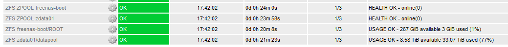

# TrueNAS Nagios Plugin

Checks ZFS health and available disk space using SNMP V2



Specify a 'zpool' and 'dataset' to check, health mode is for zpools only.

Handles TrueNAS SNMP OID's a bit better than 'check_smtp' by using 'OID.Index'.

The check is meant to be used with multiple service defines in a nagios host cfg.
See Example below.
Options can also be set as variables in the script itself (instead of using args).

Tested with TrueNAS 12.0 U2

## Requirements

- Nagios: Net-SNMP (snmpwalk, snmpget) and FREENAS-MIB.txt
- TrueNAS: SNMP Service needs to be enabled, default community string is 'public'

## Values

Usage percentages to check are set with args '-c' for critical and '-w' for warning.

For absolute values: '-C' and '-W'.

To skip a check set 0: `-w 0` `-c 0` and/or `-W 0` `-C 0`

You can also vars in script instead:

```
P_WARN="85"
P_CRIT="95"
A_WARN="100000000" # Warning at 1TiB available diskspace
A_CRIT="50000000"  # Critical at 500GiB
```

## Example config

The cfg files can be added to your existing Nagios config:

- [commands.cfg](commands.cfg)
- [services.cfg](services.cfg)

## Usage

`check_truenas.sh -h`

```
USAGE: ./check_truenas.sh -A agent -S community -m file.mib -Z zpool -D dataset
                          -M <health|usage> -w 85 -c 95 -W 1000 -C 500

OPTIONS: -A Agent host/ip
         -S communityString
         -m MIB file
         -Z Check Zpool health/usage
         -D Check Dataset usage
         -M Mode: 'health' or 'usage'
         -w warning <n> -c critical <n> where n is max % usage
         -W Warning <n> -c Critical <n> where n is max abs usage

```
